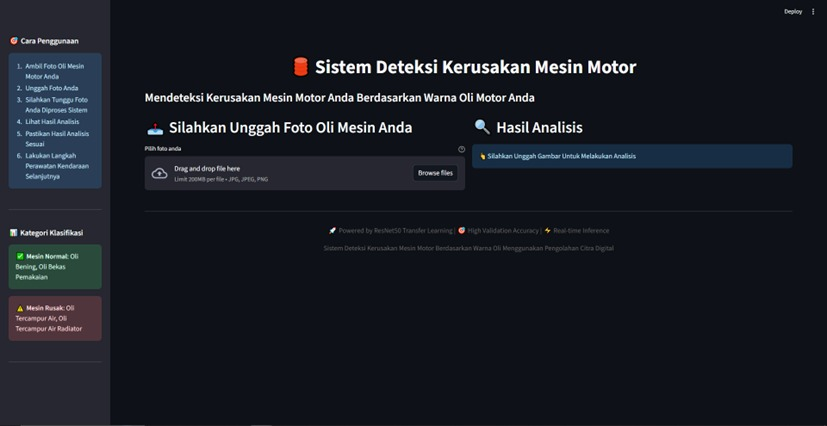
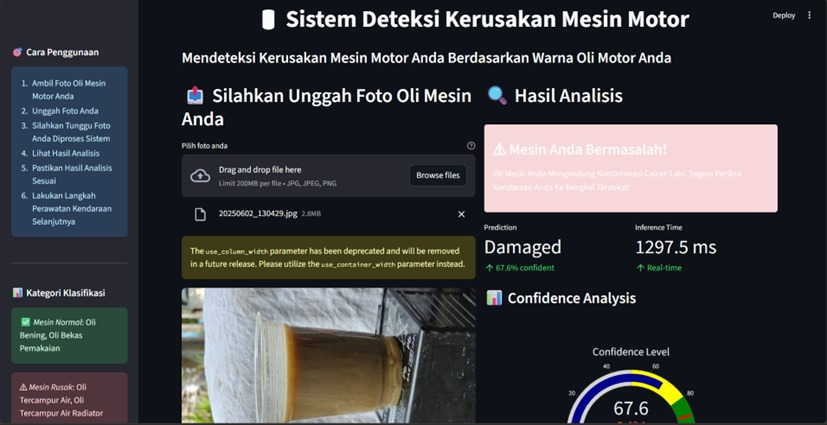
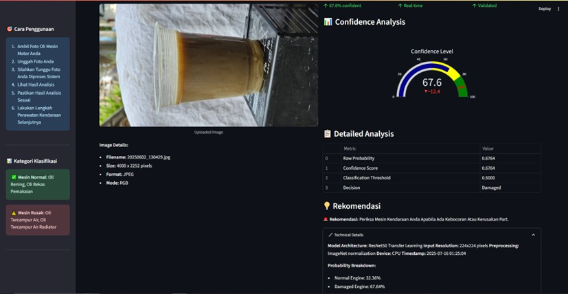

# Deteksi Kerusakan Mesin Motor Berdasarkan Warna Oli Mesin Menggunakan Pengolahan Citra

Aplikasi ini dibangun dengan mengumpulkan dataset dari beberapa kondisi oli mesin motor, yaitu : 
- Oli Bersih
- Oli Hitam
- Oli Tercampur Air
- Oli Tercampur Coolant

Dari keempat sampel oli tersebut, dibedakan 2 kondisi mesin kendaraan bermotor, yaitu : 
- Mesin Normal
- Mesin Rusak

Aplikasi ini dibangun dengan menggunakan model CNN yang dilatih secara berulang ulang demi mendapatkan akurasi yang sempurna. CNN bekerja dengan mengekstrak fitur penting dari data masukan, seperti pola, tekstur, atau warna, melalui lapisan konvolusi dan pooling untuk menghasilkan representasi fitur yang lebih sederhana namun informatif.

Adapun tampilan hasil aplikasi kami sebagai berikut : 

